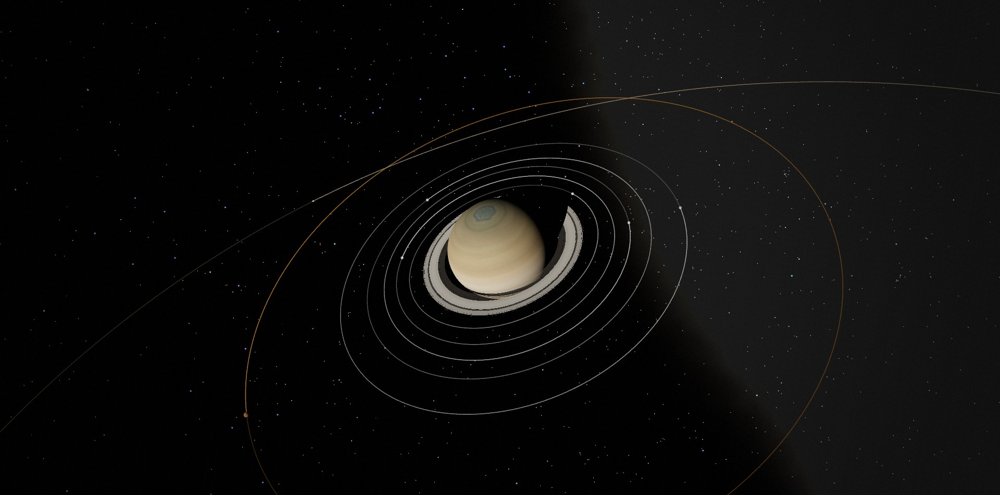
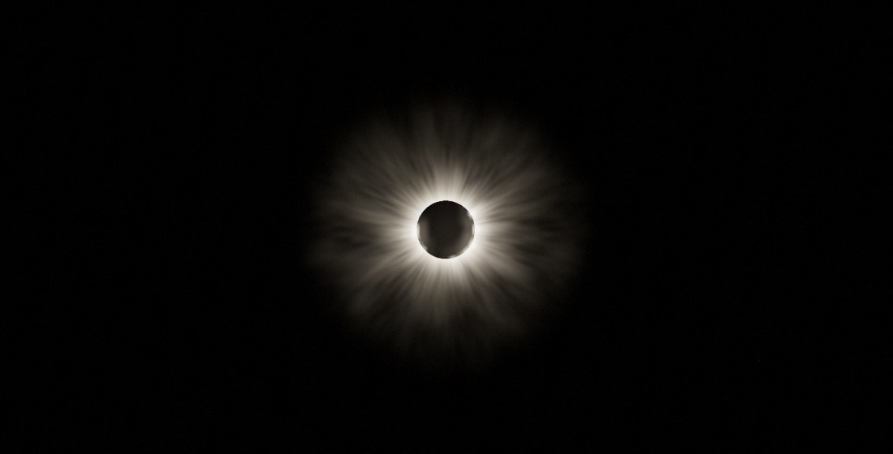
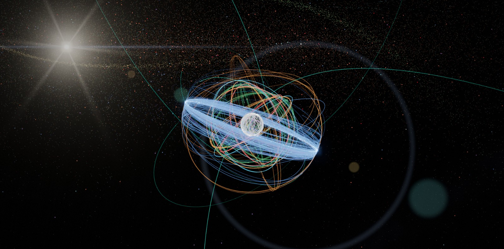
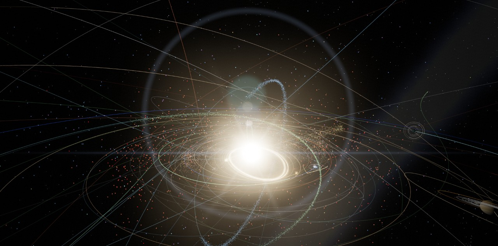

  

<h1 align="center">Sol — a scientifically accurate Solar System</h1>

  <b>Every planet, moon, comet, asteroid, spacecraft and satellite, where it really is, for any moment from 1800 to 2050.</b> 
  Real-time 3-D in your browser · no install · no account

  <a href="https://slaveplanet-hash.github.io/solar-system/"><b>▶ Open the live simulator</b></a>
  &nbsp;·&nbsp; <a href="INSTALL.md">Run it locally</a>
  &nbsp;·&nbsp; <a href="#talk-to-it-through-an-ai">Talk to it through an AI</a>

---

Sol is a real-time 3-D model of the Solar System built on the same data astronomers use: NASA/JPL ephemerides, JPL Horizons trajectories, the JPL small-body database, the Yale Bright Star Catalogue and the U.S. Space Force satellite catalogue. It isn't an artist's impression. Pick any date and every object is drawn where it actually was or will be, and the simulator checks itself against NASA's numbers.

The Saturn above is the view from 22° above its ring plane on **15 June 2017**. That year the Sun lit the rings at a steep angle, so they shine and the planet casts its shadow across them. Pick a date in 2025 and they are dark, because the Sun is edge-on to them.

## What's inside

| | |
|---|---|
| **Planets & Moon** | JPL orbital elements, valid 1800–2050 and checked against JPL Horizons. Real rotation, axial tilt, day and night sides, and photographic textures up to 8K. |
| **20 major moons** | The Galilean moons, Titan, Triton, Charon and more, fitted to JPL Horizons, with their orbits drawn around each planet. |
| **~100,000 small bodies** | 50,000 asteroids, all ~42,500 near-Earth objects, ~8,300 Kuiper-belt objects and Centaurs, plus comets and interstellar visitors (ʻOumuamua, Borisov, 3I/ATLAS). All computed on the GPU. |
| **Comets & meteors** | Ion and dust tails that curve the way real ones do, meteor streams, and meteors raining from the right radiant when Earth crosses them. |
| **Spacecraft** | Voyager 1 & 2, Pioneer 10 & 11, New Horizons, Parker Solar Probe, JWST, Juno and Europa Clipper, on their real trajectories. |
| **~960 Earth satellites** | The ISS, Hubble, GPS, Galileo, GLONASS, BeiDou, weather and science satellites and the geostationary belt, each with its orbit path. |
| **Eclipses & events** | An *Upcoming events* panel lists eclipses, planetary conjunctions, meteor showers, asteroid flybys and comet perihelia. Click one to be taken there. |
| **Stand anywhere** | Stand on any planet or moon and watch the sky, or fly your own ship, including a 3-D model you drop onto the page. |
| **True or visual scale** | Switch between real sizes and distances (vast and empty) and a visual mode where everything fits on screen. |

<table>
  <tr>
    <td width="50%"></td>
    <td width="50%"></td>
  </tr>
  <tr>
    <td><b>Total solar eclipse, 12 August 2026</b>, from the central line off Iceland at totality. The Events panel stages this for you.</td>
    <td><b>Earth's satellites today.</b> The geostationary belt, the navigation-satellite shells and the low-orbit swarm, with each satellite's orbit path computed with SGP4.</td>
  </tr>
  <tr>
    <td colspan="2"></td>
  </tr>
  <tr>
    <td colspan="2"><b>The inner Solar System</b> with the asteroid belt, near-Earth objects, comet orbits and meteor streams.</td>
  </tr>
</table>

## How accurate is it?

Accuracy is tested, not assumed. `npm test` and the in-app **✓ Verify** button compare Sol with reference data:

| What | Checked against | Result |
|---|---|---|
| Planet positions | JPL Horizons (DE441) | arcsecond-level, 1800–2050 |
| Eclipses | NASA's eclipse catalogue, 2021–2030 | all 44 found, correct type, time within minutes |
| Major moons | JPL Horizons | fitted mean elements (Moon: a few km) |
| Planet brightness | JPL Horizons magnitudes | within 0.1 mag |
| Satellites (SGP4) | JPL Horizons' ISS track | 0.2 km average |
| Sky positions from a place | JPL Horizons observer mode | within 0.03° |

Satellite orbits change quickly, so satellites come from a snapshot that is refreshed every few days. Each one is shown only within 30 days of its data, and marked *approximate* after 3.

## Talk to it through an AI

Sol includes an **MCP server**, so an AI assistant can run simulations for you. It works with Claude Code, Claude Desktop, OpenCode and other MCP apps. Ask:

- *"When is the next total solar eclipse? Show it to me."*
- *"When can I see the ISS from Chicago this week?"* It predicts passes, including whether each one is visible to the naked eye.
- *"Is Jupiter up tonight from London?"*
- *"Fly to Saturn in 2017 and take a picture."* The images on this page were made exactly this way.

The AI gets two kinds of tools:
- **Precise calculations** that need no browser: positions, the sky from any place, eclipses, conjunctions, satellite passes.
- **Control of the simulator on screen:** time, camera, standing on a surface, staging events, screenshots, and full scripting.

One double-click on `install-mcp.bat` sets it up. See [INSTALL.md](INSTALL.md#6-talk-to-it-through-an-ai-mcp).

## Run it yourself

Open the **[live version](https://slaveplanet-hash.github.io/solar-system/)**, or run it on your own computer to get the full dataset, fresh satellites and the AI connection. The step-by-step guide for Windows is in **[INSTALL.md](INSTALL.md)**: install Node.js, double-click `update.bat`, run `npm run serve`, and open `http://localhost:8130/`.

Handy links, all of which work on the live site:

- [Saturn with its rings wide open (2017)](https://slaveplanet-hash.github.io/solar-system/?focus=saturn&t=2017-06-15T00:00&rate=0)
- [The Moon's shadow on Earth, 8 April 2024](https://slaveplanet-hash.github.io/solar-system/?focus=earth&t=2024-04-08T18:18&rate=0&scale=true)
- [The red Moon of a total lunar eclipse](https://slaveplanet-hash.github.io/solar-system/?focus=moon&t=2025-03-14T06:58&rate=0&scale=true)
- [Voyager 1 in interstellar space](https://slaveplanet-hash.github.io/solar-system/?focus=voyager1)
- [Standing on Europa under Jupiter](https://slaveplanet-hash.github.io/solar-system/?focus=europa&surface=europa)

## Built with

- [three.js](https://threejs.org/) for WebGL2, with custom shaders for atmospheres, rings, eclipse shadows and a GPU Kepler solver.
- Plain JavaScript modules: no build step and no runtime dependencies.
- Node.js scripts to download the data.
- [satellite.js](https://github.com/shashwatak/satellite-js) (MIT, vendored) for SGP4.

**Data:**
- NASA/JPL Solar System Dynamics (Standish elements, Horizons, SBDB, close-approach data);
- NASA GSFC eclipse tables (F. Espenak);
- Meeus, *Astronomical Algorithms*;
- IAU WGCCRE rotation models;
- Yale Bright Star Catalogue (CDS VizieR V/50);
- International Meteor Organization;
- CelesTrak GP data (U.S. Space Force catalogue).

**Textures:** [Solar System Scope](https://www.solarsystemscope.com/textures/) ([CC BY 4.0](https://creativecommons.org/licenses/by/4.0/)), based on NASA mission imagery. Details in `textures/CREDITS.md`.

## License

The code is released under the [MIT License](LICENSE). The textures, the bundled satellite.js library and the downloaded data keep their own licenses and terms; see [LICENSE](LICENSE) for details.
